# NEXUM

**Multimodal Social Knowledge Graph Memory Engine with Live Visualization**

> Comprehensive Technical Report — Version 3.0 — February 2026
> 76 Files · 11,114 Lines of Code · 11 Platforms · Neo4j Graph · Full-Stack Production System
> Prepared for Abdelrahman

---

## Table of Contents

- [[#1. Executive Summary]]
- [[#2. System Architecture Overview]]
- [[#3. Architecture Graph]]
- [[#4. Database Schema]]
- [[#5. Machine Learning Pipeline]]
- [[#6. Multimodal Fusion Search Engine]]
- [[#7. Vector Database Configuration]]
- [[#8. Automated Crawler System]]
- [[#9. Self-Improving Feedback Loop]]
- [[#10. REST API Specification]]
- [[#11. Frontend Application]]
- [[#12. Configuration System]]
- [[#13. Key Engineering Decisions]]
- [[#14. Scalability and Performance]]
- [[#15. Reliability and Fault Tolerance]]
- [[#16. Security and Compliance]]
- [[#17. Observability and Monitoring]]
- [[#18. Multi-Platform Support]]
- [[#19. Quality Audit v2 — Changelog]]
- [[#20. VRAM Budget & GPU Strategy]]
- [[#21. End-to-End Usage Example]]
- [[#22. Complete File Manifest]]
- [[#23. Deployment Instructions]]
- [[#24. Social Knowledge Graph Extension (v3)]]
- [[#25. Comment Ingestion & NLP Pipeline]]
- [[#26. Neo4j Graph Database Layer]]
- [[#27. Threaded Conversation Graph]]
- [[#28. Entity & Topic Graph]]
- [[#29. 10-Modality Fusion Search]]
- [[#30. Live Knowledge Graph Visualization]]
- [[#31. v3 File Manifest]]
- [[#32. Summary]]

---

## 1. Executive Summary

Nexum is a production-grade, self-hosted multimodal social knowledge graph engine that enables natural language queries to find precise moments inside video content and understand the social discourse surrounding them. Unlike traditional video search that matches titles or descriptions, Nexum indexes the actual content of videos across four sensory modalities (spoken words, visual scenes, on-screen text, contextual signals) plus five social modalities (comment semantics, timestamp references, agreement clusters, entity overlap, user cluster confidence) — totaling **10 search modalities** fused into a single ranked result.

The system processes videos from **11 major platforms** (YouTube, TikTok, Twitter/X, Instagram, Twitch, Vimeo, Dailymotion, Reddit, Facebook, Bilibili) plus 1,700+ additional sites via yt-dlp. It automatically discovers content through a crawler-to-index pipeline, ingests threaded comment trees with NLP analysis (sentiment, NER, topic classification, toxicity), stores multimodal embeddings in a vector database, and maintains a Neo4j knowledge graph of relationships between videos, comments, users, entities, topics, and channels.

**v3 adds**: comment ingestion with recursive thread trees, per-comment NLP (sentiment, NER, topic classification, timestamp extraction, spam/toxicity scoring), Neo4j graph database with 17 edge types, entity co-occurrence networks, user interaction loop detection, debate cluster analysis, 10-modality fusion search, WebSocket event streaming, and a live graph visualization page at `/graph-live` with Cytoscape.js rendering.

The system is implemented as a monorepo containing 76 files and 11,114 lines of code across a Python/FastAPI backend, Next.js frontend, six ML/NLP services, Celery task queues (4 queue types), PostgreSQL (14 tables), Redis, Qdrant (3 vector collections), Neo4j (6 node types, 17 edge types), and MinIO, all orchestrated via Docker Compose with 12 containers.

---

## 2. System Architecture Overview

Nexum follows a microservices architecture where each concern is isolated into its own service, communicating through Redis message queues and shared databases. The system is divided into three layers: the **ingestion layer** (crawler + media processing), the **intelligence layer** (ML pipeline + vector store), and the **serving layer** (search API + frontend).

### 2.1 Infrastructure Components

| Service | Technology | Port | Purpose |
|---------|-----------|------|---------|
| PostgreSQL 16 | `postgres:16-alpine` | 5432 | Relational metadata storage (videos, segments, frames, comments, entities, users, feedback) |
| Redis 7 | `redis:7-alpine` | 6379 | Celery broker, result backend, caching |
| Qdrant v1.11 | `qdrant/qdrant:v1.11.0` | 6333/6334 | Vector similarity search — text, visual, and comment collections |
| Neo4j 5 | `neo4j:5-community` | 7474/7687 | Knowledge graph — threaded comments, entities, user relationships |
| MinIO | `minio/minio:latest` | 9000/9001 | S3-compatible object storage for video/audio artifacts |
| API Server | FastAPI + Uvicorn | 8000 | REST API + WebSocket serving search, graph, comments, admin endpoints |
| Processing Worker | Celery | — | ML pipeline execution (1 concurrent, sequential GPU) |
| Crawler Worker | Celery | — | Multi-platform channel crawling (CPU-only) |
| Comment Worker | Celery | — | Comment ingestion and NLP processing (2 concurrent) |
| Graph Worker | Celery | — | Neo4j graph sync and analysis tasks (2 concurrent) |
| Celery Beat | Celery | — | Periodic task scheduler (crawl cycles, recalibration) |
| Frontend | Next.js 14 | 3000 | User interface for search, video detail, and admin |

### 2.2 Docker Orchestration

All services are defined in a split Docker Compose setup: `docker-compose.yml` (base, works on any machine) and `docker-compose.gpu.yml` (GPU override with NVIDIA device access). The backend Dockerfile uses a `TORCH_INDEX` build arg to select between CPU and CUDA 12.4 PyTorch builds. Tesseract OCR includes the Arabic language pack (`tesseract-ocr-ara`), and EasyOCR is configured for English + Arabic.

**CPU deployment:** `docker compose up -d`
**GPU deployment:** `docker compose -f docker-compose.yml -f docker-compose.gpu.yml up -d`

### 2.3 Data Flow

The end-to-end data flow begins when Celery Beat triggers a crawl cycle. The crawler reads the `channels.txt` seed list, uses yt-dlp to extract video metadata from any supported platform without downloading, scores each video by priority, and inserts processing tasks into the Celery queue. The processing worker then downloads the video, runs the full ML pipeline (transcription → frame extraction → OCR → visual classification → embedding generation) with **sequential GPU loading** (load model → process → release VRAM → load next model), stores metadata in PostgreSQL, upserts vectors to Qdrant, and marks the video as indexed. When a user searches, the API decomposes the query, runs parallel vector searches and keyword matches, fuses the scores with configurable weights, applies temporal coherence boosting, and returns ranked results with platform-aware timecoded URLs.

---

## 3. Architecture Graph


### Processing Pipeline Flow

```mermaid
flowchart LR
    A[Video URL] --> B[Download<br/>yt-dlp]
    B --> C[Audio Extract<br/>FFmpeg 16kHz]
    C --> D[Transcribe<br/>Whisper large-v3<br/>beam=10]
    D --> E[Segment<br/>Chunking<br/>2s overlap]
    B --> F[Frame Sample<br/>every 1.5s<br/>blur < 15]
    F --> G[OCR<br/>EasyOCR + Tesseract<br/>EN + AR]
    F --> H[Visual Tags<br/>CLIP ViT-L-14<br/>40+ objects]
    E --> I[Text Embed<br/>mpnet-base-v2<br/>768-dim]
    G --> J[Enrich Payloads<br/>OCR → Segments<br/>20s window]
    H --> K[Visual Embed<br/>CLIP ViT-L-14<br/>768-dim]
    I --> L[Qdrant Upsert<br/>batch=256]
    K --> L
    J --> L
    L --> M[✅ INDEXED]

    style A fill:#333,stroke:#666,color:#fff
    style M fill:#2d5016,stroke:#4a8c2a,color:#fff
    style D fill:#1a3a5c,stroke:#2e6da4,color:#fff
    style G fill:#1a3a5c,stroke:#2e6da4,color:#fff
    style H fill:#1a3a5c,stroke:#2e6da4,color:#fff
    style I fill:#1a3a5c,stroke:#2e6da4,color:#fff
    style K fill:#1a3a5c,stroke:#2e6da4,color:#fff
```



### Search Pipeline Flow

```mermaid
flowchart LR
    Q[User Query] --> QU[Query Understanding<br/>6 Dimensions]
    QU --> TV[Text Vector Search<br/>nexum_text · 768-dim]
    QU --> VV[Visual Vector Search<br/>nexum_visual · 768-dim]
    QU --> KW[Keyword Match<br/>Transcript]
    QU --> OCR[OCR Match<br/>Numbers + Text]
    TV --> F[Fusion Engine]
    VV --> F
    KW --> F
    OCR --> F
    F --> TC[Temporal<br/>Coherence ±30s]
    TC --> CW[Confidence<br/>Weighting]
    CW --> R[Ranked Results<br/>+ Explanations<br/>+ Timecoded URLs]

    style Q fill:#333,stroke:#666,color:#fff
    style F fill:#4a1a5c,stroke:#8c2ea4,color:#fff
    style R fill:#2d5016,stroke:#4a8c2a,color:#fff
```



### Video Status State Machine


---

## 4. Database Schema

The PostgreSQL schema consists of nine tables with full foreign key relationships, enumerated types for status tracking, UUID primary keys, and performance indices on high-frequency query paths.

### 4.1 Core Tables

| Table | Key Columns | Purpose |
|-------|------------|---------|
| `channels` | platform_id (unique), name, url, platform, priority_tier (1–5), last_crawled_at, is_active | Multi-platform channel registry with crawl scheduling |
| `videos` | platform_id (unique), channel_id (FK), platform, title, url, thumbnail_url, duration_seconds, view_count, status (enum), priority_score, model_version | Video metadata and processing state machine |
| `segments` | video_id (FK), start_time, end_time, text, language, confidence, speaker_label, embedding_id, model_version | Transcribed speech chunks (10–20s each) |
| `frames` | video_id (FK), timestamp, visual_tags (JSON), ocr_text, ocr_confidence, scene_label, embedding_id, is_scene_change | Sampled video frames with extracted features |
| `users` | username (unique), email (unique), hashed_password, role (enum: user/admin), is_active | Authentication and access control |
| `feedback` | user_id (FK), video_id (FK), segment_id (FK), query_text, feedback_type (enum), suggested_timestamp, comment | User feedback for search quality improvement |
| `model_versions` | name, version, model_type, is_active, config_json, accuracy_metrics | ML model registry with version tracking |
| `evaluation_metrics` | metric_name, metric_value, model_version_id (FK), details (JSON), measured_at | Historical accuracy and performance metrics |
| `crawl_logs` | channel_id (FK), video_platform_id, action, status, details (JSON) | Audit trail for crawler operations |

### 4.2 Enumerated Types

- **VideoStatus:** `discovered → queued → downloading → processing → indexed | failed` — Tracks each video through the processing pipeline with clear state transitions.
- **Platform:** `youtube, tiktok, twitter, instagram, twitch, vimeo, dailymotion, reddit, facebook, bilibili, other` — Identifies source platform.
- **CrawlPriority:** `critical (1), high (2), normal (3), low (4), background (5)` — Determines queue ordering.
- **FeedbackType:** `upvote, downvote, timestamp_correction, mismatch_report` — Categorizes user signals.
- **UserRole:** `user, admin` — Controls access to admin endpoints.

### 4.3 Performance Indices

Composite indices are defined on: video status + uploaded_at (queue ordering), segment video_id + start_time (timeline queries), frame video_id + timestamp (frame lookups), and feedback video_id + feedback_type (aggregation). All foreign keys are indexed by default through SQLAlchemy relationships.

---

## 5. Machine Learning Pipeline

The ML pipeline consists of four specialized services that process video content into searchable embeddings and metadata. Each service is lazily loaded on first use to minimize memory footprint, supports model hot-swapping via the `model_versions` table, and uses **sequential GPU loading** to stay within the 12 GB VRAM budget.

### 5.1 Speech-to-Text Service

- **Engine:** faster-whisper (CTranslate2-optimized Whisper)
- **Model:** `whisper-large-v3` (1.5B parameters, ~3.0 GB VRAM)
- **Beam size:** 10, best_of=5 for maximum transcription accuracy
- **Languages:** Auto-detected, with Arabic support
- **Process:** Audio extracted via FFmpeg (WAV, 16kHz mono) → language detection with confidence scoring → transcription with word-level timestamps → filler word cleanup ("um", "uh", "like" removal) → chunking into 10–20 second segments with **2.0s overlapping boundaries** → speaker segmentation via pause detection
- **Output:** Typically 200–500 segments per hour of video, each with aligned timestamps accurate to ±0.5 seconds

### 5.2 OCR Service

- **Engines:** Dual-engine architecture using EasyOCR (neural, EN + AR) and Tesseract (traditional, EN + AR via `tesseract-ocr-ara`)
- **Preprocessing:** Contrast normalization, CLAHE enhancement for improved character recognition on varied backgrounds
- **Confidence Threshold:** 0.30 (aggressive, captures more text)
- **Consensus Scoring:** When both engines detect the same text, confidence is boosted by 20%. When they disagree, the higher-confidence result wins.
- **Temporal Smoothing:** Adjacent frames within a **20-second enrichment window** are compared. Text appearing in multiple consecutive frames gets a stability bonus; transient single-frame detections are penalized.
- **Numeric Emphasis:** Special handling for numeric tokens (scores, timestamps, statistics) with boosted confidence.

### 5.3 Visual Classification Service

- **Engine:** OpenCLIP `ViT-L-14` (Vision Transformer, **768-dimensional** output, ~1.8 GB VRAM)
- **Shared CLIP:** VisionService shares the CLIP model instance from EmbeddingService (no duplicate VRAM loading)
- **Zero-Shot Classification:** CLIP classifies against arbitrary text labels without training. Four curated label sets:
  - **Objects** (40+ labels): person, car, computer, phone, whiteboard, camera, food, book, etc.
  - **Scenes** (25+ labels): office, classroom, kitchen, outdoors, studio, stage, laboratory, etc.
  - **Activities** (20+ labels): typing, presenting, cooking, playing game, drawing, writing code, etc.
  - **Styles** (20+ labels): animated, live action, screen recording, diagram, tutorial, vlog, etc.
- **Frame Selection:** Frames sampled every **1.5 seconds** (dense sampling). Scene change detection via histogram comparison. Blur detection (Laplacian variance < **15.0**) filters unusable frames. Batch classification with conservative `batch_size=8`. Top-5 labels per category stored as JSON.
- **Max Frames:** 5,000 per video

### 5.4 Embedding Service

- **Text Embeddings:** `sentence-transformers/all-mpnet-base-v2` (**768-dimensional**, cosine similarity, ~0.4 GB VRAM). Captures semantic meaning — queries like "someone explaining recursion" match segments about recursive algorithms.
- **Visual Embeddings:** OpenCLIP `ViT-L-14` (**768-dimensional**, cosine similarity). Encodes frames into the same embedding space as text for cross-modal retrieval.
- **Float16 Compression:** All embeddings stored in half-precision floating point, halving memory with negligible accuracy loss (<0.1% recall degradation).
- **Model Versioning:** Each embedding tagged with model version. Old embeddings identified and re-generated via the re-index pipeline.
- **`reset_cache()` method:** Enables model reload scenarios for hot-swapping.

### 5.5 Complete Processing Pipeline

When a video enters the processing queue, the Media Service orchestrates this pipeline with proper status transitions (`QUEUED → DOWNLOADING → PROCESSING → INDEXED`):

1. **Download:** yt-dlp downloads video with platform-specific format selection (YouTube: `bestvideo[height<=1080]+bestaudio`, TikTok: `best`, etc.)
2. **Audio Extraction:** FFmpeg converts to WAV at 16kHz mono for optimal Whisper input
3. **GPU Phase 1 — Transcription:** Load Whisper large-v3 (3.0 GB) → transcribe with beam=10 → release VRAM
4. **Segment Chunking:** Raw transcription split into 15-second aligned segments with 2.0s overlap
5. **Frame Sampling:** Integer-based frame counting (`frame_idx % frame_interval_count`) for numerical stability, every 1.5s, blur threshold 15.0
6. **GPU Phase 2 — Vision + OCR:** Load CLIP ViT-L-14 (1.8 GB) + mpnet (0.4 GB) + EasyOCR (0.8 GB) → process all frames → release
7. **OCR Processing:** Dual-engine OCR on each frame with temporal smoothing across 20s enrichment window
8. **Visual Classification:** CLIP zero-shot tagging (objects, scenes, activities, styles) on each frame
9. **Embedding Generation:** Text embeddings (768-dim) + visual embeddings (768-dim)
10. **Vector Upsert:** Batch upsert (256 points per batch) to Qdrant with enriched payloads
11. **Cleanup:** Temporary files deleted. Metadata persisted to PostgreSQL. Status → INDEXED

The pipeline runs under Celery task management with a 1-hour soft time limit, 2-hour hard limit, and 3 automatic retries with **exponential backoff** (`countdown = 60 × 2^retries`).

---

## 6. Multimodal Fusion Search Engine

The search engine is the core differentiator of Nexum. Rather than searching a single index, it decomposes queries into structured dimensions, runs parallel searches across multiple modalities, and fuses results using a configurable weighted scoring formula with temporal coherence boosting.

### 6.1 Query Understanding

Every incoming query is decomposed into six structured dimensions:

| Dimension | Example Extractions | Used For |
|-----------|-------------------|----------|
| Objects | "tetris", "whiteboard", "Python" | Visual tag matching, keyword search |
| Actions | "struggling", "playing", "explaining" | Activity classification matching |
| Numbers | "1296", "42", "3.14" | OCR text matching (scores, stats) |
| Time/Era | "90s", "medieval", "retro" | Contextual filtering |
| Emotion | "struggling", "excited", "confused" | Emotion context scoring |
| Context | "tutorial", "review", "live stream" | Style/genre filtering |

### 6.2 Vector Search

Two parallel vector searches execute against Qdrant collections:

- **Text Collection (`nexum_text`, 768-dim):** Query encoded via mpnet-base-v2, compared against transcript segment embeddings using cosine similarity. Top-100 results retrieved with payload filtering.
- **Visual Collection (`nexum_visual`, 768-dim):** Query encoded via CLIP ViT-L-14 text encoder, compared against frame embeddings. Cross-modal retrieval: text queries match visual content. Top-100 results.

### 6.3 Keyword and OCR Matching

In parallel with vector search, exact and fuzzy keyword matching runs against transcript text and OCR text. Numbers extracted from the query are specifically matched against OCR text fields.

### 6.4 Multimodal Fusion Formula

```
final_score = (text_semantic × 0.35)
            + (visual_similarity × 0.20)
            + (ocr_match × 0.15)
            + (keyword_match × 0.15)
            + (temporal_coherence × 0.10)
            + (emotion_context × 0.05)
```

| Component | Weight | Description |
|-----------|--------|-------------|
| `text_semantic` | 0.35 | Cosine similarity between query and segment embeddings |
| `visual_similarity` | 0.20 | Cross-modal CLIP similarity between query text and frame |
| `ocr_match` | 0.15 | Exact/fuzzy match against on-screen text |
| `keyword_match` | 0.15 | Direct term overlap with transcript text |
| `temporal_coherence` | 0.10 | Boost when adjacent segments (±30s) also match |
| `emotion_context` | 0.05 | Alignment between detected query emotion and content tone |

### 6.5 Confidence Weighting

Each result's final score is multiplied by: `score *= (0.7 + 0.3 × confidence)`. Segments with low transcription confidence or low OCR confidence are penalized relative to high-confidence matches.

### 6.6 Temporal Coherence Boosting

After initial scoring, a temporal coherence pass examines whether adjacent segments (within ±30 seconds) also appear in the result set. When they do, both receive a coherence boost. This handles queries spanning multiple moments and reduces isolated false positives.

### 6.7 Explanation Generation

Every search result includes a human-readable explanation: *"OCR detected '1296' on screen | Transcript semantically matches 'struggling' and 'tetris' | Visual tags include 'video game screen'"*.

### 6.8 Platform-Aware Timecoded URLs

Search results include deep links with platform-specific timestamp formats:

| Platform | Format | Example |
|----------|--------|---------|
| YouTube | `?t=123s` | `youtube.com/watch?v=abc&t=123s` |
| Twitch | `?t=1h2m3s` | `twitch.tv/videos/123?t=1h2m3s` |
| Vimeo | `#t=123s` | `vimeo.com/123#t=123s` |
| TikTok | *(no timestamp support)* | Original URL returned |
| Instagram | *(no timestamp support)* | Original URL returned |

---

## 7. Vector Database Configuration

| Collection | Dimensions | Distance | Payload Indices |
|-----------|-----------|----------|----------------|
| `nexum_text` | 768 | Cosine | video_id, channel_id, language, model_version, timestamp |
| `nexum_visual` | 768 | Cosine | video_id, channel_id, model_version, timestamp |

Both collections use HNSW indexing for approximate nearest neighbor search, providing sub-millisecond query times at millions of vectors. Batch upserts of 256 points minimize write overhead. Payload filtering enables scoped searches.

**Payload Enrichment:** OCR text from frames is injected into payloads of nearby transcript segments (20s window). This creates cross-modality linkage at the data level — OCR-triggered matches surface transcript results and vice versa.

---

## 8. Automated Crawler System

The crawler automates video discovery and prioritization from **11 platforms**, running as a periodic Celery task on a CPU-only worker.

### 8.1 Multi-Platform Channel Configuration

Channels are defined in `channels.txt` with platform-specific URL formats:

```
# YouTube
https://www.youtube.com/@3blue1brown  4
https://www.youtube.com/@Fireship      3

# TikTok (max 30 videos per cycle)
https://www.tiktok.com/@username        3

# Twitter/X
https://twitter.com/handle              3

# Twitch
https://www.twitch.tv/channelname       2
```

### 8.2 Platform Detection

The crawler uses regex patterns to detect platforms and extract channel IDs:

| Platform | Channel ID Format | Example |
|----------|------------------|---------|
| YouTube | `yt:channel_id` | `yt:UC...` |
| TikTok | `tt:username` | `tt:@username` |
| Twitter | `tw:handle` | `tw:@handle` |
| Twitch | `twitch:channel` | `twitch:channelname` |
| Vimeo | `vimeo:channel` | `vimeo:channelname` |

### 8.3 Priority Scoring Algorithm

```
score = log10(views) × w1 + recency × w2 – duration_penalty
      + keyword_boost + engagement_boost + tier_boost
```

Platform-aware duration checks: minimum 5s for TikTok (short-form), maximum 4h for YouTube (long-form).

### 8.4 Rate Limiting

- TikTok: max 30 videos per cycle
- Other platforms: max 50 videos per cycle
- 2-second delay between API calls
- Generic video URL handling via yt-dlp metadata extraction

---

## 9. Self-Improving Feedback Loop

### 9.1 Feedback Collection

Users provide four types of feedback: upvote, downvote, timestamp correction, and mismatch report. Each entry stores the original query text for per-query analysis.

### 9.2 Automatic Recalibration

A daily Celery task at 3:00 AM analyzes 7 days of feedback. It adjusts fusion weights using a learning rate of 0.02, bounded between 0.05 and 0.50 per weight. All changes logged to `evaluation_metrics`.

---

## 10. REST API Specification

| Method | Endpoint | Description |
|--------|----------|-------------|
| POST | `/api/v1/search` | Execute multimodal search with query, filters, pagination |
| GET | `/api/v1/search?q=...` | Quick search via query parameter |
| GET | `/api/v1/videos` | List all videos with optional status and platform filter |
| GET | `/api/v1/videos/{id}` | Video detail with segments, frames, platform, metadata |
| POST | `/api/v1/feedback` | Submit user feedback |
| GET | `/api/v1/feedback/stats` | Aggregated feedback statistics |
| GET | `/api/v1/admin/metrics` | System-wide stats |
| POST | `/api/v1/admin/reindex` | Trigger re-indexing |
| GET | `/api/v1/admin/models` | List model versions |
| GET/PUT | `/api/v1/admin/weights` | View or update fusion weights |
| GET | `/api/v1/admin/evaluation` | Historical evaluation metrics |
| GET | `/api/v1/admin/vector-stats` | Qdrant collection sizes |
| GET | `/health` | Health check |
| GET | `/metrics` | Prometheus metrics |

All endpoints support JSON. CORS configurable, rate limiting (60 req/min), JWT auth for admin endpoints. Video responses include `platform` field with enum serialization.

---

## 11. Frontend Application

Built with Next.js 14, React 18, TypeScript, Tailwind CSS, and SWR. Dark theme with DM Serif Display (headings), IBM Plex Sans (body), JetBrains Mono (code). Accent: dark goldenrod `#d4a843`.

### 11.1 Search Page (`/`)

Hero section with animated search bar, collapsible filter panel (modality, sort, confidence, views, channel, **platform**), result cards with: thumbnail + timestamp badge, confidence indicator, channel + view count, transcript snippet, visual tag chips, OCR matches, expandable score breakdown, jump-to-moment links (platform-aware), feedback buttons.

### 11.2 Video Detail Page (`/video/[id]`)

Content density heatmap timeline, three tabs: Transcript (clickable timestamps), Visual Tags (frame-by-frame), OCR Text (confidence pips). Platform badge displayed.

### 11.3 Admin Dashboard (`/admin`)

Stat cards (videos by status, segments, frames, upvote ratio), vector store metrics, fusion weight sliders (0.00–0.50), re-index trigger, evaluation metrics log.

### 11.4 Frontend-Backend Alignment

All ID types are `string` (UUID). Field names match backend schemas exactly: `confidence_score` (not `score`), `modality_scores` (not `score_breakdown`). API base URL includes `/api/v1` prefix.

---

## 12. Configuration System

| File | Contents |
|------|---------|
| `channels.txt` | Multi-platform seed list with priority tiers (1–5) |
| `models.yaml` | ML model names (large-v3, ViT-L-14, mpnet-base-v2), versions, dimensions, VRAM budget |
| `fusion_weights.yaml` | Default fusion weights, recalibration schedule, learning rate |
| `priority_rules.yaml` | Crawler priority scoring: view/recency multipliers, keyword boosts |
| `limits.yaml` | System limits: frame_sample_interval=1.5s, min_duration=5s, max_frames=5000, concurrency=1 |

The Pydantic config class (`app/core/config.py`) provides type-safe access with `_auto_device()` that runs at import time — every process auto-detects CUDA independently (no frozen Settings mutation).

---

## 13. Key Engineering Decisions

### 13.1 Dual-Engine OCR with Consensus

EasyOCR (neural) + Tesseract (traditional) in parallel. Agreement boosts confidence; disagreement selects higher-confidence result. Significantly reduces false positives on stylized text.

### 13.2 Differential Embedding Spaces

Text segments use mpnet-base-v2 (semantic similarity), visual frames use CLIP ViT-L-14 (cross-modal alignment). Text-to-text captures nuance; text-to-visual captures appearance.

### 13.3 Temporal Coherence as a Signal

Adjacent segments (±30s) that also match receive a cluster boost. Exploits sequential nature of video; reduces isolated false positives.

### 13.4 Payload Enrichment

OCR text injected into nearby transcript segment payloads (20s window). Enables cross-modality linkage without query-time cross-referencing.

### 13.5 Sequential GPU Loading

Instead of loading all models simultaneously (~6 GB), models load and release sequentially: Whisper (3 GB) → release → CLIP + mpnet + EasyOCR (3 GB) → release. Peak VRAM stays at ~3 GB, comfortable within 12 GB budget.

### 13.6 Integer-Based Frame Sampling

Replaced floating-point modular arithmetic (`timestamp % interval > 1.0/fps`) with integer frame counting (`frame_idx % frame_interval_count`). Eliminates numerical instability in frame selection.

### 13.7 Graceful Degradation

If OCR fails, pipeline continues. If CLIP unavailable, text-only search works. Each modality contributes independently; no single failure breaks the system.

---

## 14. Scalability and Performance

### 14.1 Horizontal Scaling

Processing workers are stateless. 1 worker per GPU for GPU-accelerated processing. Crawler on separate CPU-only worker.

### 14.2 GPU Acceleration

Auto-detected via `_auto_device()` at import time. On RTX 5070 Ti with quality-first models (large-v3, ViT-L-14), expected throughput: ~8–12 videos per hour.

### 14.3 Resource Constraints

| Resource | Limit | Rationale |
|----------|-------|-----------|
| Max frames per video | 5,000 | Dense 1.5s sampling support |
| Frame sample interval | 1.5 seconds | Quality-first dense sampling |
| Min video duration | 5 seconds | TikTok short-form support |
| Max video duration | 4 hours | YouTube long-form limit |
| Processing timeout | 2 hours | Prevents stuck workers |
| Search top-k | 100 → 10 | Retrieve 100, return top 10 after fusion |
| Processing concurrency | 1 | Sequential GPU loading |
| Segment overlap | 2.0 seconds | Context continuity |
| Download quality | 1080p (YouTube) | Quality-first |

---

## 15. Reliability and Fault Tolerance

1. **Celery Retries:** 3 retries with exponential backoff (`60 × 2^retries` seconds)
2. **Database Transactions:** SQLAlchemy async sessions with automatic rollback
3. **Health Checks:** Every Docker service has health checks; dependent services wait for upstream health
4. **Graceful Degradation:** Missing modality results don't block pipeline
5. **Error Logging:** Failed videos store error details, maintain "failed" status
6. **Connection Pooling:** PostgreSQL and Redis connections pooled
7. **Worker Health Checks:** Periodic liveness reporting (every 60s)
8. **Proper Status Transitions:** `QUEUED → DOWNLOADING → PROCESSING → INDEXED` (no skipped states)

---

## 16. Security and Compliance

1. **Authentication:** JWT tokens with bcrypt password hashing
2. **Authorization:** Role-based access (user/admin)
3. **CORS:** Configurable restrictions
4. **Rate Limiting:** 60 req/min per client
5. **Secrets Management:** Environment variables only, never hardcoded
6. **Platform Compliance:** Rate limiting per platform (TikTok: 30/cycle), yt-dlp built-in compliance

---

## 17. Observability and Monitoring

| Category | Metrics |
|----------|---------|
| Pipeline | Videos processed/indexed/queued/failed, segments, frames, processing time |
| Search Quality | Upvote ratio, precision@1, precision@5, latency, confidence distribution |
| ML Models | WER, OCR accuracy, visual tag accuracy, embedding throughput |
| Infrastructure | Worker count, queue depth, storage usage, CPU/memory |
| Feedback | Daily upvote/downvote counts, weight adjustment history |

Endpoints: `/health` (liveness), `/metrics` (Prometheus), admin dashboard (web UI), structlog JSON logging.

---

## 18. Multi-Platform Support

### 18.1 Supported Platforms

| Platform | Download Format | Channel Discovery | Timecoded URLs | Rate Limit |
|----------|---------------|------------------|---------------|------------|
| YouTube | `bestvideo[height<=1080]+bestaudio` | Channels, playlists, shorts | `?t=123s` | 50/cycle |
| TikTok | `best` | User pages, videos | None | 30/cycle |
| Twitter/X | `best` | Profiles, tweet videos | None | 50/cycle |
| Instagram | `best` | Reels, posts | None | 50/cycle |
| Twitch | `best` | VODs, clips | `?t=1h2m3s` | 50/cycle |
| Vimeo | `best` | Channels, videos | `#t=123s` | 50/cycle |
| Dailymotion | `best` | Channels | None | 50/cycle |
| Reddit | `best` | v.redd.it | None | 50/cycle |
| Facebook | `best` | fb.watch | None | 50/cycle |
| Bilibili | `best` | User pages | None | 50/cycle |
| Other | `best` (yt-dlp) | Via URL | None | 50/cycle |

### 18.2 Platform-Aware Features

- **Download format selection** per platform via `_get_download_format()`
- **Channel ID extraction** via `_extract_channel_id()` with regex patterns
- **Canonical URL building** via `_build_video_url()` for consistent storage
- **Timecoded URL generation** via `_build_timecoded_url()` for search results
- **Platform-specific duration validation** (TikTok min: 5s, YouTube max: 4h)
- **yt-dlp fallback** for 1,700+ additional sites

---

## 19. Quality Audit v2 — Changelog

### 19.1 Model Upgrades

| Component | Before (v1) | After (v2) | VRAM |
|-----------|------------|-----------|------|
| Whisper | base (74M params) | **large-v3** (1.5B params) | 3.0 GB |
| CLIP | ViT-B-32 (512-dim) | **ViT-L-14** (768-dim) | 1.8 GB |
| Text embeddings | MiniLM-L6 (384-dim) | **mpnet-base-v2** (768-dim) | 0.4 GB |
| Beam size | 5 | **10**, best_of=5 | — |
| Frame interval | 2.5s | **1.5s** | — |
| Max frames | 2,000 | **5,000** | — |
| Download quality | 720p | **1080p** | — |
| OCR languages | English only | **English + Arabic** | 0.8 GB |
| OCR threshold | 0.40 | **0.30** (more text captured) | — |
| Segment overlap | 0s | **2.0s** (context continuity) | — |

### 19.2 Critical Bugs Fixed

| # | Bug | Before | After |
|---|-----|--------|-------|
| 1 | **CUDA Detection Failure** | `device: str = "cpu"` hardcoded, `main.py` tried to mutate frozen Settings | `_auto_device()` runs at import time, every process auto-detects |
| 2 | **Import Order Bug** | `Optional[str]` used before import in tasks.py | `from typing import Optional` at top |
| 3 | **Duplicate CLIP Loading** | EmbeddingService + VisionService each loaded CLIP (~3 GB total) | VisionService shares via `embedding_service.clip_model` |
| 4 | **Frame Sampling Instability** | `timestamp % interval > (1.0/fps)` floating-point unreliable | Integer frame counting `frame_idx % frame_interval_count` |
| 5 | **Missing Status Transition** | `QUEUED → PROCESSING` (skipped DOWNLOADING) | `QUEUED → DOWNLOADING → PROCESSING → INDEXED` |
| 6 | **Blur Threshold Inconsistency** | media_service=30, vision_service=80 | Unified `settings.blur_threshold = 15.0` |
| 7 | **Frontend Type Mismatches** | `video_id: number`, field names differ | `video_id: string`, exact schema alignment |
| 8 | **Schema Forward Reference** | SearchRequest referenced SearchFilters before definition | SearchFilters defined first |

### 19.3 New Features Added

- Multi-platform support (11 platforms + 1,700 via yt-dlp)
- Platform-aware timecoded URLs
- Sequential GPU VRAM management
- Arabic OCR support (EasyOCR + Tesseract)
- Docker CPU/GPU split deployment
- Platform field in all API responses
- `reset_cache()` for model hot-swapping

---

## 20. VRAM Budget & GPU Strategy

### RTX 5070 Ti — 12 GB VRAM


| Phase | Models Loaded | VRAM Usage |
|-------|--------------|------------|
| Phase 1 | Whisper large-v3 | ~3.0 GB |
| Phase 2 | CLIP + mpnet + EasyOCR | ~3.0 GB |
| **Peak** | — | **~3.0 GB** |
| **Available** | — | 12.0 GB |
| **Headroom** | — | 9.0 GB |

The sequential loading strategy ensures models are never co-resident in VRAM, keeping peak usage at ~3 GB — well within the 12 GB budget with 9 GB headroom for batch processing and CUDA overhead.

---

## 21. End-to-End Usage Example

**Query:** `"guy struggling playing tetris at score 1296"`

### 21.1 Query Decomposition

| Dimension | Extracted |
|-----------|----------|
| Objects | tetris |
| Actions | struggling, playing |
| Numbers | 1296 |
| Emotion | struggling |

### 21.2 Parallel Search Execution

1. **Text Vector Search:** Encodes query via mpnet-base-v2, searches `nexum_text` (768-dim), retrieves top-100 semantically similar segments
2. **Visual Vector Search:** Encodes via CLIP ViT-L-14 text encoder, searches `nexum_visual` for video game scene frames
3. **Keyword Match:** Searches transcript for "tetris", "struggling", "playing", "score"
4. **OCR Match:** Searches on-screen text specifically for "1296"

### 21.3 Expected Result

| Field | Value |
|-------|-------|
| Video Title | Tetris Tournament Finals Highlights |
| Platform | YouTube |
| Channel | RetroGaming |
| Timestamp | 3:42 |
| Link | `youtube.com/watch?v=abc&t=222s` |
| Transcript | "oh no I'm at 1296 and the blocks are falling too fast..." |
| Visual Tags | video game screen, person, game controller |
| OCR Text | SCORE: 1296 |
| Confidence | 0.87 (High) |
| Score | 82 |
| Explanation | OCR detected '1296' on screen · Transcript matches 'struggling' and 'tetris' · Visual tags include 'video game screen' |

---

## 22. Complete File Manifest

### 22.1 Backend (Python)

| File | Lines | Purpose |
|------|-------|---------|
| `app/main.py` | 109 | FastAPI application, lifespan hooks, CORS, clean startup logging |
| `app/core/config.py` | 113 | Pydantic Settings with `_auto_device()` at import time |
| `app/core/database.py` | ~50 | Async SQLAlchemy engine, session factory |
| `app/models/models.py` | 216 | 9 ORM models with Platform enum, relationships |
| `app/schemas/schemas.py` | ~180 | Pydantic schemas, platform field, forward-reference fix |
| `app/ml/embeddings/embedding_service.py` | 136 | mpnet-base-v2 (768d) + CLIP ViT-L-14 (768d) |
| `app/ml/ocr/ocr_service.py` | 205 | Dual-engine OCR, EN+AR, consensus scoring |
| `app/ml/speech/speech_service.py` | 195 | Whisper large-v3, beam=10, best_of=5 |
| `app/ml/vision/vision_service.py` | 196 | Shared CLIP, expanded labels, `reset_cache()` |
| `app/services/search/query_understanding.py` | 153 | 6-dimension decomposition |
| `app/services/search/vector_store.py` | 227 | Qdrant wrapper, 768-dim collections |
| `app/services/search/search_service.py` | 335 | Fusion pipeline, platform-aware timecoded URLs |
| `app/services/media/media_service.py` | 412 | Multi-platform download, sequential GPU, integer sampling |
| `app/services/crawler/crawler_service.py` | 344 | Multi-platform discovery, channel ID extraction |
| `app/services/feedback/feedback_service.py` | 153 | Feedback collection, weight recalibration |
| `app/workers/tasks.py` | 150 | Celery tasks, exponential backoff, queue routing |
| `app/api/routes/search.py` | ~80 | Search endpoint |
| `app/api/routes/videos.py` | ~60 | Video listing with platform filter |
| `app/api/routes/admin.py` | ~120 | Admin endpoints |
| `app/api/routes/feedback.py` | ~50 | Feedback endpoints |

### 22.2 Frontend (TypeScript/React)

| File | Purpose |
|------|---------|
| `src/app/layout.tsx` | Root layout with nav bar, fonts, status indicator |
| `src/app/page.tsx` | Search page with hero, results, platform filter |
| `src/app/video/[id]/page.tsx` | Video detail with heatmap, platform badge |
| `src/app/admin/page.tsx` | Admin dashboard |
| `src/app/globals.css` | Global styles, noise texture, animations |
| `src/components/SearchBar.tsx` | Search with suggestions and decomposition tags |
| `src/components/FilterPanel.tsx` | Collapsible filters |
| `src/components/ResultCard.tsx` | Result display with score breakdown |
| `src/components/SearchStats.tsx` | Result count, timing, modality indicator |
| `src/lib/api.ts` | API client with `/api/v1` base, string IDs |
| `src/lib/types.ts` | TypeScript interfaces, string IDs, platform field |
| `src/lib/utils.ts` | Formatting helpers |

### 22.3 Configuration and Infrastructure

| File | Purpose |
|------|---------|
| `docker-compose.yml` | Base: CPU deployment, all services |
| `docker-compose.gpu.yml` | GPU override: NVIDIA device access |
| `docker/Dockerfile.backend` | Python 3.11, TORCH_INDEX arg, tesseract-ocr-ara |
| `docker/Dockerfile.frontend` | Multi-stage Node 20 Alpine |
| `config/channels.txt` | Multi-platform seed list with examples |
| `config/models.yaml` | Quality-first models, VRAM budget docs |
| `config/fusion_weights.yaml` | Fusion weights, recalibration settings |
| `config/priority_rules.yaml` | Crawler priority scoring |
| `config/limits.yaml` | Dense sampling, TikTok min duration, sequential GPU |

---

## 23. Deployment Instructions

### 23.1 Quick Start

1. Extract `nexum.tar.gz` to your desired directory
2. Edit `config/channels.txt` with your target channels and priority tiers
3. **CPU:** `docker compose up -d`
4. **GPU:** `docker compose -f docker-compose.yml -f docker-compose.gpu.yml up -d`
5. Access frontend at `http://localhost:3000`, API at `http://localhost:8000`
6. Run migrations: `docker compose exec api alembic upgrade head`
7. Crawler begins automatically, discovering and queuing videos

### 23.2 Build Options

```bash
# CPU build
docker compose build --build-arg TORCH_INDEX=cpu

# GPU build (CUDA 12.4)
docker compose -f docker-compose.yml -f docker-compose.gpu.yml build --build-arg TORCH_INDEX=cu124
```

### 23.3 Production Hardening

Change all default passwords, enable TLS via reverse proxy (nginx/Caddy), configure CORS origins, set up log rotation, enable PostgreSQL backups, mount Qdrant on persistent volume. First video processing downloads ~5 GB of ML models.

---

## 24. Social Knowledge Graph Extension (v3)

### 24.1 Transformation Overview

v3 transforms Nexum from a **Multimodal Video Memory Search Engine** into a **Multimodal Social Knowledge Graph Memory Engine with Live Visualization**. The core principle: extend without breaking any existing functionality. Every v2 capability remains intact; v3 adds an entirely new dimension of understanding.

**Before (v2):** Nexum understands what's IN the video — spoken words, visual scenes, on-screen text.

**After (v3):** Nexum also understands what people THINK about the video — threaded discussions, sentiment patterns, entity references, community relationships, knowledge evolution over time.

### 24.2 New System Components

| Component | Technology | Purpose |
|-----------|-----------|---------|
| Comment Ingestion Service | yt-dlp + async Python | Fetch threaded comments from all platforms |
| Comment NLP Service | sentence-transformers + spaCy + HuggingFace | Sentiment, NER, topic classification, toxicity |
| Graph Database | Neo4j 5 Community | Relationship storage and traversal |
| Graph Service | neo4j async driver | Node/edge CRUD, snapshots, audience overlap |
| Traversal Service | Cypher queries | Thread analysis, debate detection, chains |
| Event Streaming | WebSocket + SSE | Real-time graph mutation broadcast |
| Live Visualization | Cytoscape.js + Next.js | Interactive graph rendering at /graph-live |

### 24.3 Data Model Extension

**PostgreSQL Tables (v3 additions):**

| Table | Rows (typical) | Purpose |
|-------|----------------|---------|
| `comment_authors` | 10K–1M | Public discussion participants |
| `comments` | 50K–10M | Threaded comment trees with NLP annotations |
| `entities` | 5K–100K | Named entities (people, orgs, locations, products) |
| `entity_mentions` | 50K–500K | Where each entity was mentioned |
| `topics` | 17–500 | Topic classification labels |
| `topic_assignments` | 10K–1M | Topic-to-source assignments |

**Total PostgreSQL tables:** 14 (was 9)

---

## 25. Comment Ingestion & NLP Pipeline

### 25.1 Ingestion Flow

```
Video (INDEXED) → yt-dlp comment extraction → Rate limit → Dedup
→ Spam filter (heuristic) → Thread tree construction → Store to PostgreSQL
→ Emit graph events → Queue NLP processing
```

Comment ingestion runs every 10 minutes for recently indexed videos, fetching up to 200 top-level comments with recursive replies up to depth 20.

### 25.2 NLP Processing Pipeline

Each comment passes through 8 processing stages:

1. **Embedding Generation** — all-mpnet-base-v2 (768-dim), same model as transcript embeddings for cross-modal search
2. **Sentiment Analysis** — cardiffnlp/twitter-roberta-base-sentiment-latest; outputs score (-1.0 to 1.0) and label (positive/negative/neutral)
3. **Named Entity Recognition** — spaCy en_core_web_sm; extracts PERSON, ORG, GPE, PRODUCT, EVENT entities
4. **Topic Classification** — Zero-shot via facebook/bart-large-mnli; classifies into 17 topic categories
5. **Timestamp Extraction** — Regex patterns for "1:23", "at 5 minutes", "30 seconds"; maps to video segment references
6. **Numeric Token Extraction** — Captures numbers for OCR cross-referencing
7. **Toxicity Scoring** — Heuristic (caps ratio, punctuation, length); extensible to ML model
8. **Spam Scoring** — Pattern matching (self-promo, multi-URL, character repetition); engagement-weighted

### 25.3 Storage Strategy

Long comments (>2000 chars) are zlib-compressed in `text_compressed`. Embeddings are upserted to the dedicated `nexum_comments` Qdrant collection with payloads including video_id, sentiment, topics, and like_count for filtered search.

---

## 26. Neo4j Graph Database Layer

### 26.1 Schema

**6 Node Types:**

| Node | Key Property | Indices |
|------|-------------|---------|
| Video | `video_id` (unique) | — |
| Comment | `comment_id` (unique) | video_id, root_thread_id, depth_level, timestamp_posted |
| CommentAuthor | `author_id` (unique) | comment_count |
| Entity | `canonical_name` (unique) | entity_type, mention_count |
| Topic | `name` (unique) | — |
| Channel | `channel_id` (unique) | — |

**17 Edge Types:**

| Edge | Source → Target | Properties |
|------|----------------|------------|
| WROTE | CommentAuthor → Comment | — |
| REPLIES_TO | Comment → Comment | — |
| ON | Comment → Video | — |
| MENTIONS | Comment → Entity | — |
| REFERENCES_TIMESTAMP | Comment → Segment | at (seconds) |
| REPLIED_TO | CommentAuthor → CommentAuthor | count |
| COMMENTED_ON | CommentAuthor → Video | — |
| PARTICIPATED_IN | CommentAuthor → Topic | — |
| OVERLAPS_WITH | CommentAuthor → CommentAuthor | shared_videos |
| ENGAGED_WITH | CommentAuthor → Channel | — |
| DISCUSSES | CommentAuthor → Entity | count |
| UPLOADED | Channel → Video | — |
| COVERS | Channel → Topic | — |
| SHARES_AUDIENCE_WITH | Channel → Channel | shared_users |
| APPEARS_IN | Entity → Frame | — |
| MENTIONED_IN | Entity → Comment | — |
| CO_OCCURS_WITH | Entity → Entity | count, sources |

### 26.2 Dual Database Architecture

Nexum uses **two complementary databases**:

- **Qdrant (Vector DB)**: Answers "what is semantically similar?" — nearest-neighbor search in 768-dim embedding space
- **Neo4j (Graph DB)**: Answers "what is structurally related?" — traversal of typed relationships between entities

This separation allows each database to excel at its strength. Search queries hit both: vector search finds content matches, graph traversal adds relationship context and social signals.

### 26.3 Graph Sync

A dedicated `sync_graph_task` (Celery, graph queue) propagates PostgreSQL data into Neo4j after comment processing completes. This ensures eventual consistency between the relational store (source of truth) and the graph store (optimized for traversal).

---

## 27. Threaded Conversation Graph

### 27.1 Thread Structure

Comments form **recursive tree structures** locally (within a video) and connect globally through shared users, entities, and referenced timestamps. Each comment tracks:

- `parent_comment_id` — direct parent
- `root_thread_id` — root of the tree (for fast thread retrieval)
- `depth_level` — nesting depth (0 = top-level)
- `child_count` — direct reply count

### 27.2 Traversal Capabilities

| Query | Cypher Pattern | Use Case |
|-------|---------------|----------|
| Full thread | `(c)-[:REPLIES_TO*]->(root)` | Display complete discussion |
| All descendants | `(child)-[:REPLIES_TO*1..]->(parent)` | Expand subtree |
| Parent chain | `(c)-[:REPLIES_TO*]->(ancestor)` | Trace back to root |
| Debate clusters | Sentiment variance across thread | Find heated discussions |
| Longest chains | Max path length from leaf to root | Identify deep conversations |
| Most branched | Max child count at any node | Find controversial points |
| User loops | Bidirectional REPLIED_TO edges | Detect recurring interactions |

### 27.3 Thread Analysis Endpoint

`GET /api/v1/graph/thread/{comment_id}/analysis` returns:

- `total_comments`, `total_depth`, `unique_authors`
- `avg_sentiment`, `debate_score` (0=consensus, 1=heated)
- `longest_chain_length`, `most_branched_depth`

---

## 28. Entity & Topic Graph

### 28.1 Entity Extraction

Entities are extracted from **four sources**: transcripts, OCR text, comments, and video descriptions. Each mention is recorded in the `entity_mentions` junction table with source_type, source_id, and confidence.

Entity types: PERSON, ORGANIZATION, LOCATION, PRODUCT, EVENT, TECHNOLOGY, CONCEPT, OTHER.

### 28.2 Co-occurrence Network

When two entities appear in the same comment (or within a 5-entity window), a `CO_OCCURS_WITH` edge is created/incremented in Neo4j. This builds an emergent knowledge graph where entity relationships are discovered from discussion patterns rather than predefined.

### 28.3 Topic Classification

17 predefined topic labels are assigned via zero-shot classification. Topics are tracked at video, comment, and channel levels:

- `CHANNEL → COVERS → TOPIC`: Aggregated from channel's video topics
- `COMMENT → contains → TOPIC` (via topic_labels JSON field)
- `USER → PARTICIPATED_IN → TOPIC`: Aggregated from user's comments

### 28.4 Channel Audience Overlap

A daily task detects `SHARES_AUDIENCE_WITH` edges between channels by finding users who commented on videos from both channels. This enables cross-channel community discovery.

---

## 29. 10-Modality Fusion Search

### 29.1 Extended Formula

```python
final_score = (
    # Original modalities (v1/v2)
    text_semantic      * 0.25 +   # Transcript embedding similarity
    visual_similarity  * 0.15 +   # CLIP visual embedding similarity
    ocr_match          * 0.10 +   # On-screen text/number match
    keyword_match      * 0.10 +   # Exact keyword presence
    temporal_coherence * 0.08 +   # Adjacent segment consistency
    emotion_context    * 0.02 +   # Emotional tone alignment

    # Social Knowledge Graph modalities (v3)
    comment_semantic         * 0.10 +  # Comment text similarity to query
    comment_timestamp_boost  * 0.05 +  # Comments reference same timestamp
    agreement_cluster        * 0.05 +  # Sentiment consensus signal
    entity_overlap           * 0.05 +  # Shared entities query ↔ content
    user_cluster_confidence  * 0.05    # More unique discussants = signal
) * (0.7 + 0.3 * confidence)
```

### 29.2 Comment Modality Details

**Comment Semantic** (weight: 0.10): Query is embedded using the same mpnet model and searched against the `nexum_comments` Qdrant collection. Best comment match score per video is used.

**Comment Timestamp Boost** (weight: 0.05): If a comment references a timestamp within 30 seconds of a search result's timestamp, the boost activates. This means "the comment at 1:23 confirms the content at 1:23."

**Agreement Cluster** (weight: 0.05): Measures sentiment variance among comments on a video. Low variance (consensus) = high agreement signal. Requires 3+ comments.

**Entity Overlap** (weight: 0.05): If entities extracted from the query match entities mentioned in a video's comments/transcripts, the overlap boosts the score.

**User Cluster Confidence** (weight: 0.05): More unique comment authors discussing a topic = higher confidence the content is relevant. 5+ unique authors starts contributing signal; scales to 20.

### 29.3 Qdrant Collections (v3)

| Collection | Dimension | Purpose |
|-----------|-----------|---------|
| `nexum_text` | 768 | Transcript segment embeddings |
| `nexum_visual` | 768 | Frame CLIP embeddings |
| `nexum_comments` | 768 | Comment semantic embeddings |

---

## 30. Live Knowledge Graph Visualization

### 30.1 Architecture

```
Backend Services → emit GraphEvents → EventHub (in-memory buffer)
    ↓ (broadcast)
WebSocket /ws/graph → Connected Clients
    ↓ (fallback)
SSE /sse/graph → Polling Clients
    ↓ (render)
Cytoscape.js Canvas → Interactive Graph
```

### 30.2 Event Types

**Node Events:** VIDEO_ADDED, COMMENT_ADDED, USER_CREATED, ENTITY_DISCOVERED, CHANNEL_LINKED

**Edge Events:** COMMENT_LINKED, USER_CONNECTED, ENTITY_CO_OCCURRENCE, THREAD_EXPANDED

### 30.3 Frontend Page: `/graph-live`

The page renders a full-viewport interactive graph using Cytoscape.js with:

- **Visual node encoding**: Videos=rectangles (gold), Users=circles (blue), Comments=small dots (gray), Entities=hexagons (green), Topics=hexagons (purple), Channels=diamonds (red)
- **Live WebSocket stream**: New nodes pulse on arrival, edges fade in
- **Metrics overlay**: Node counts by type, edge count, event rate/sec, connection status
- **Controls**: Pause/Resume, node type filters, reconnect
- **Node inspector**: Click any node to see its properties
- **Event feed**: Last 8 events displayed in compact log
- **DB stats bar**: Graph-wide counts from Neo4j

### 30.4 Performance Management

- Max 500–1000 nodes rendered simultaneously
- Priority-based sampling: Videos > Channels > Entities > Topics > Users > Comments
- Automatic FIFO node eviction when buffer is full
- Cose layout algorithm for graphs under 200 nodes

---

## 31. v3 File Manifest

### 31.1 New Backend Files (10 files, 2,560 lines)

| File | Lines | Purpose |
|------|-------|---------|
| `backend/app/core/graph_database.py` | 141 | Neo4j async driver, schema bootstrap, health check |
| `backend/app/core/events.py` | 217 | WebSocket event hub, SSE generator, event buffering |
| `backend/app/ml/nlp/comment_nlp_service.py` | 364 | 8-stage NLP pipeline for comment processing |
| `backend/app/services/comments/comment_ingestion_service.py` | 409 | Platform comment fetching, threading, dedup, spam filter |
| `backend/app/services/comments/comment_processing_service.py` | 287 | NLP orchestration, entity storage, author profiles |
| `backend/app/services/graph/graph_service.py` | 409 | Neo4j CRUD for all 6 node types and 17 edge types |
| `backend/app/services/graph/traversal_service.py` | 313 | Thread traversal, debate detection, entity networks |
| `backend/app/api/routes/graph.py` | 133 | 14 graph API endpoints |
| `backend/app/api/routes/comments.py` | 195 | Comment listing, ingestion triggers, stats, entities |
| `backend/app/api/routes/websocket.py` | 92 | WebSocket + SSE endpoints for live streaming |

### 31.2 Modified Backend Files (7 files)

| File | Lines | Changes |
|------|-------|---------|
| `backend/app/core/config.py` | 215 | +40 new settings (Neo4j, NLP, graph, comment weights) |
| `backend/app/models/models.py` | 419 | +5 ORM models, +2 enums (CommentStatus, EntityType) |
| `backend/app/schemas/schemas.py` | 402 | +20 Pydantic schemas for comments/graph/entities |
| `backend/app/services/search/search_service.py` | 420 | 10-modality fusion, comment vector search integration |
| `backend/app/services/search/vector_store.py` | 262 | +nexum_comments collection, comment search/upsert |
| `backend/app/workers/tasks.py` | 355 | +6 new Celery tasks, 4 queue types, extended beat schedule |
| `backend/app/main.py` | 130 | +3 routers, Neo4j lifecycle, updated identity |

### 31.3 New Frontend Files (5 files, 703 lines)

| File | Lines | Purpose |
|------|-------|---------|
| `frontend/src/app/graph-live/page.tsx` | 143 | Full /graph-live page with canvas, metrics, controls |
| `frontend/src/components/graph/GraphCanvas.tsx` | 229 | Cytoscape.js graph renderer with typed node styles |
| `frontend/src/components/graph/GraphControls.tsx` | 101 | Pause/resume, node type filters |
| `frontend/src/components/graph/GraphMetrics.tsx` | 77 | Live metrics overlay |
| `frontend/src/lib/useGraphWebSocket.ts` | 153 | WebSocket hook with auto-reconnect, event processing |

### 31.4 Modified Frontend Files (3 files)

| File | Lines | Changes |
|------|-------|---------|
| `frontend/src/lib/types.ts` | 433 | +120 lines: graph, comment, entity, event types |
| `frontend/src/lib/api.ts` | 434 | +150 lines: graph/comment/entity/WS API functions |
| `frontend/src/app/layout.tsx` | 69 | +Graph nav link, updated site identity |

### 31.5 Config & Infrastructure (3 files)

| File | Lines | Changes |
|------|-------|---------|
| `docker-compose.yml` | 291 | +Neo4j service, +worker-comments, +worker-graph |
| `config/graph.yaml` | 74 | New: graph visualization, NLP, storage rules |
| `config/fusion_weights.yaml` | 51 | Updated: 10 modalities (was 6) |

---

## 32. Summary

Nexum v3 transforms the system from a multimodal video search engine into a **Social Knowledge Graph Memory Engine**. The system now understands not just what's in a video, but what people think, discuss, and reference about it — threaded conversations, entity relationships, community patterns, and sentiment evolution.

| Metric | v2 | v3 |
|--------|-----|-----|
| Total files | 116 | 76 (consolidated) |
| Lines of code | 6,326 | 11,114 |
| Platforms supported | 11 + 1,700 | 11 + 1,700 |
| ML/NLP models | 4 | 7 (+ sentiment, NER, topic classifier) |
| Peak VRAM | ~3 GB | ~3 GB (sequential loading) |
| Vector collections | 2 | 3 (+ comments) |
| Search modalities | 6 | 10 |
| PostgreSQL tables | 9 | 14 |
| Graph node types | — | 6 |
| Graph edge types | — | 17 |
| API endpoints | ~15 | ~35 |
| Docker containers | 9 | 12 |
| Celery task queues | 2 | 4 |
| WebSocket/SSE | — | Yes (live graph events) |
| OCR languages | en + ar | en + ar |

**The system understands:** video sensory content (vision, audio, OCR), spoken meaning (transcripts), on-screen text, human discussion (comments, threads), community relationships (user-user, user-channel, channel-channel), and knowledge evolution (entity co-occurrence, topic drift, sentiment trends).

**Searchable by:** semantic similarity (vector search), structural relationships (graph traversal), social context (user clusters, agreement patterns), and real-time visualization (live graph updates).

---

> [!info] Archive
> **File:** `nexum.tar.gz`
> **Version:** 3.0 — Social Knowledge Graph Extension
> **Generated:** February 10, 2026
